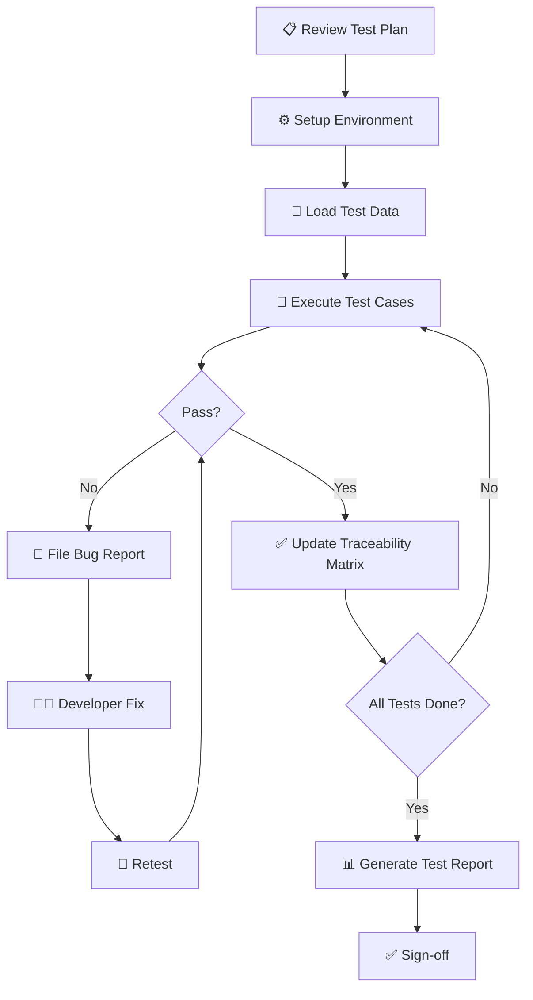

# 📚 Testing Documentation - Flower Shop Inventory System

> Bộ tài liệu kiểm thử hoàn chỉnh cho module Inventory Management của hệ thống Flower Shop

---

## 📋 Mục Lục

- [Giới Thiệu](#giới-thiệu)
- [Cấu Trúc Tài Liệu](#cấu-trúc-tài-liệu)
- [Thống Kê](#thống-kê)
- [Hướng Dẫn Sử Dụng](#hướng-dẫn-sử-dụng)
- [Workflow Testing](#workflow-testing)
- [Yêu Cầu Hệ Thống](#yêu-cầu-hệ-thống)
- [Liên Hệ](#liên-hệ)

---

## 🎯 Giới Thiệu

Bộ tài liệu này cung cấp **đầy đủ test cases, test data, và quy trình kiểm thử** cho module Inventory Management của hệ thống Flower Shop. Được thiết kế để đảm bảo chất lượng sản phẩm thông qua việc kiểm thử có hệ thống và toàn diện.

### Phạm Vi Kiểm Thử

Tài liệu này cover **3 chức năng chính**:

| Chức Năng | Mã | Mô Tả |
|-----------|-----|-------|
| **Login** | FR_01 | Xác thực đăng nhập, khóa tài khoản sau 3 lần sai |
| **Add Product** | FR_02 | Thêm sản phẩm hoa mới với validation |
| **Search** | FR_03 | Tìm kiếm sản phẩm theo tên hoặc ID |

### Business Rules

| Quy Tắc | Mã | Nội Dung |
|---------|-----|----------|
| **Price Rule** | BR_01 | Giá bán phải lớn hơn giá nhập |
| **Stock Rule** | BR_02 | Số lượng tồn kho không được âm |
| **Required Fields** | BR_03 | Tên hoa và Giá bán là bắt buộc |

---

## 📁 Cấu Trúc Tài Liệu

Bộ tài liệu gồm **10 files** được tổ chức như sau:

### 1️⃣ Requirements & Planning

| File | Mô Tả | Kích Thước |
|------|-------|------------|
| [`01_TestPlan_Requirements.md`](01_TestPlan_Requirements.md) | Software Requirements Specification (SRS) | 855 B |
| [`02_TestPlan.md`](02_TestPlan.md) | Kế hoạch kiểm thử tổng quát | 5.6 KB |

**Nội dung:**
- Phạm vi và chiến lược kiểm thử
- Lịch trình: 10 ngày với 6 giai đoạn
- Test environment requirements
- Entry/Exit criteria
- Risk management

---

### 2️⃣ Test Cases (34 Test Cases)

| File | Feature | Số Test Cases | Kích Thước |
|------|---------|---------------|------------|
| [`04_TestCases_Login.md`](04_TestCases_Login.md) | Login (FR_01) | 8 | 8.5 KB |
| [`05_TestCases_AddProduct.md`](05_TestCases_AddProduct.md) | Add Product (FR_02) | 13 | 13.6 KB |
| [`06_TestCases_Search.md`](06_TestCases_Search.md) | Search (FR_03) | 13 | 10.8 KB |

#### Chi Tiết Test Cases:

**🔐 Login (8 test cases)**
- ✅ Đăng nhập thành công
- ❌ Username/Password sai
- 🔒 Khóa tài khoản sau 3 lần sai
- 🛡️ SQL Injection prevention
- 🔤 Password case sensitive

**➕ Add Product (13 test cases)**
- ✅ Thêm sản phẩm hợp lệ
- 📋 Validate Business Rules (BR_01, BR_02, BR_03)
- 🔢 Boundary testing (giá = 0, số lượng = 0)
- ⚠️ Negative testing (giá âm, required fields)
- 🔤 Special characters và data types

**🔍 Search (13 test cases)**
- 🎯 Exact match và partial match
- 🔢 Search by ID
- 🔠 Case insensitive
- 🛡️ SQL Injection prevention
- ⚡ Performance testing

---

### 3️⃣ Test Data & Database

| File | Mô Tả | Kích Thước |
|------|-------|------------|
| [`07_TestData.md`](07_TestData.md) | Test data cho users & products | 9.1 KB |
| [`03_SQL_Validation_Queries.sql`](03_SQL_Validation_Queries.sql) | 50+ SQL queries để validate database | 20.5 KB |

**Test Data bao gồm:**
- 6 user accounts (valid/locked/inactive)
- 10 sản phẩm hoa mẫu
- Invalid test data cho negative testing
- SQL injection test strings

**SQL Queries bao gồm:**
- INSERT scripts để setup test database
- Validation queries cho Business Rules
- Data integrity checks
- Performance testing queries
- Security validation
- Cleanup scripts

---

### 4️⃣ Traceability & Reporting

| File | Mô Tả | Kích Thước |
|------|-------|------------|
| [`08_RequirementsTraceabilityMatrix.md`](08_RequirementsTraceabilityMatrix.md) | Ánh xạ Requirements ↔ Test Cases | 8.9 KB |
| [`09_TestExecutionReport_Template.md`](09_TestExecutionReport_Template.md) | Template báo cáo kết quả test | 7.6 KB |
| [`10_BugReport_Template.md`](10_BugReport_Template.md) | Template báo cáo bug | 9.3 KB |

**Traceability Matrix:**
- ✅ 100% coverage cho 6 requirements
- Mapping 34 test cases → 3 FR + 3 BR
- Test execution tracking
- Defect tracking by requirement

**Templates:**
- Professional format với đầy đủ sections
- Examples và guidelines
- Sign-off sections
- Severity/Priority definitions

---

## 📊 Thống Kê

### Test Coverage

```
📌 Total Requirements: 6
   ├─ Functional Requirements: 3 (FR_01, FR_02, FR_03)
   └─ Business Rules: 3 (BR_01, BR_02, BR_03)

📝 Total Test Cases: 34
   ├─ Login: 8 test cases
   ├─ Add Product: 13 test cases
   └─ Search: 13 test cases

✅ Requirements Coverage: 100%
```

### Test Case Distribution

**By Priority:**
```
🔴 Critical:  5 cases (14.7%)
🟠 High:     13 cases (38.2%)
🟡 Medium:   13 cases (38.2%)
🟢 Low:       3 cases (8.8%)
```

**By Type:**
```
✅ Positive:   9 cases (26.5%)
❌ Negative:  17 cases (50.0%)
📏 Boundary:   5 cases (14.7%)
🛡️ Security:   3 cases (8.8%)
```

### Documents

```
📄 Total Files: 10
💾 Total Size: ~84 KB
🌐 Language: Tiếng Việt
📋 Format: Markdown + SQL
```

---

## 🚀 Hướng Dẫn Sử Dụng

### Cho Test Lead

1. **Review kế hoạch**
   ```
   📖 Đọc: 02_TestPlan.md
   🎯 Mục đích: Hiểu strategy, timeline, resources
   ```

2. **Verify coverage**
   ```
   📊 Xem: 08_RequirementsTraceabilityMatrix.md
   ✅ Đảm bảo: 100% requirements covered
   ```

3. **Assign tasks**
   ```
   👥 Phân công: Test cases cho team members
   📅 Timeline: 10 ngày theo test plan
   ```

---

### Cho Testers

#### Bước 1: Setup Environment

```bash
# 1. Chuẩn bị môi trường
OS: Windows 10/11
JDK: Java 17+
Database: MySQL 8.0
```

#### Bước 2: Load Test Data

```sql
-- 2. Chạy SQL scripts từ file 07_TestData.md
-- Hoặc import từ:
source 03_SQL_Validation_Queries.sql
-- (Section 1: Setup Test Data)
```

#### Bước 3: Execute Test Cases

```
📝 Login Tests
   └─ File: 04_TestCases_Login.md
   └─ Execute: TC_LOGIN_001 đến TC_LOGIN_008

📝 Add Product Tests
   └─ File: 05_TestCases_AddProduct.md
   └─ Execute: TC_ADDPROD_001 đến TC_ADDPROD_013

📝 Search Tests
   └─ File: 06_TestCases_Search.md
   └─ Execute: TC_SEARCH_001 đến TC_SEARCH_013
```

#### Bước 4: Validate với SQL

```sql
-- Sau mỗi test case, chạy SQL queries để verify
-- Example: Sau TC_LOGIN_005
SELECT username, failed_login_count, is_locked 
FROM users WHERE username = 'testuser';
-- Expected: failed_login_count >= 3, is_locked = true
```

#### Bước 5: Report Results

```
🐛 Bug Found?
   └─ Use: 10_BugReport_Template.md
   └─ Fill: All sections với screenshot

📊 Test Complete?
   └─ Fill: 09_TestExecutionReport_Template.md
   └─ Update: 08_RequirementsTraceabilityMatrix.md
```

---

### Cho Developers

1. **Review test cases** để hiểu test scenarios
   ```
   📖 Files: 04, 05, 06_TestCases_*.md
   ```

2. **Reproduce bugs**
   ```
   🐛 Check: 10_BugReport_Template.md
   📋 Follow: Steps to Reproduce
   ```

3. **Validate fixes**
   ```sql
   -- Run validation queries từ:
   03_SQL_Validation_Queries.sql
   ```

4. **Update bug status**
   ```
   ✏️ Fill: Root Cause & Fix Details sections
   ```

---

### Cho Project Managers

1. **Monitor progress**
   ```
   📊 View: 09_TestExecutionReport_Template.md
   📈 Metrics: Pass rate, bug count, coverage
   ```

2. **Review risks**
   ```
   ⚠️ Check: 02_TestPlan.md Section 8
   ```

3. **Approve release**
   ```
   ✅ Verify: Exit criteria met
   📝 Sign-off: Test execution report
   ```

---

## 🔄 Workflow Testing

### Quy Trình Kiểm Thử Chuẩn



### Timeline (10 Ngày)

| Ngày | Giai Đoạn | Hoạt Động |
|------|-----------|-----------|
| 1-2 | Planning | Review requirements, setup environment |
| 3 | Data Prep | Load test data, verify database |
| 4-6 | Execution | Run all 34 test cases |
| 7-8 | Bug Fix | Log bugs, developer fixes, retest |
| 9 | Reporting | Generate test execution report |
| 10 | Sign-off | Final review và approve |

---

## 💻 Yêu Cầu Hệ Thống

### Phần Cứng
- **RAM:** 4GB minimum
- **CPU:** Intel Core i3 hoặc tương đương
- **Storage:** 500MB cho test data

### Phần Mềm
- **OS:** Windows 10/11
- **JDK:** Java 17 trở lên
- **Database:** MySQL 8.0
- **IDE:** IntelliJ IDEA / Eclipse (optional, để debug)
- **Browser:** Chrome/Firefox (nếu có UI testing)

### Test Data
- **Users:** 6 accounts (xem `07_TestData.md`)
- **Products:** 10 sản phẩm mẫu
- **Database:** Test database riêng (không dùng production!)

---

## 📖 Tài Liệu Tham Khảo

### Đọc Theo Thứ Tự

1. **Bắt đầu:** `01_TestPlan_Requirements.md` - Hiểu requirements
2. **Kế hoạch:** `02_TestPlan.md` - Strategy và timeline
3. **Test Cases:** Files `04`, `05`, `06` - Test scenarios chi tiết
4. **Test Data:** `07_TestData.md` - Dữ liệu test
5. **SQL Queries:** `03_SQL_Validation_Queries.sql` - Database validation
6. **Traceability:** `08_RequirementsTraceabilityMatrix.md` - Coverage tracking
7. **Templates:** Files `09`, `10` - Reporting templates

### Quick Reference

```
❓ Cần gì?                    👉 Xem file nào?
━━━━━━━━━━━━━━━━━━━━━━━━━━━━━━━━━━━━━━━━━━━━━━
📋 Requirements              → 01_TestPlan_Requirements.md
🎯 Test Strategy             → 02_TestPlan.md
🧪 Test Cases                → 04, 05, 06_TestCases_*.md
💾 Test Data                 → 07_TestData.md
🗄️ SQL Queries               → 03_SQL_Validation_Queries.sql
📊 Coverage Mapping          → 08_RequirementsTraceabilityMatrix.md
📝 Report Bug                → 10_BugReport_Template.md
📈 Test Results              → 09_TestExecutionReport_Template.md
```

---

## 🎓 Best Practices

### ✅ Nên Làm

- ✅ **Đọc kỹ test cases** trước khi execute
- ✅ **Follow exact steps** trong test cases
- ✅ **Verify với SQL** sau mỗi test
- ✅ **Screenshot** khi tìm thấy bug
- ✅ **Update traceability matrix** real-time
- ✅ **Backup database** trước khi test
- ✅ **Use test data** từ file 07_TestData.md

### ❌ Không Nên

- ❌ **Không test trên production database**
- ❌ **Không skip preconditions**
- ❌ **Không modify test data giữa các tests**
- ❌ **Không assume kết quả** - phải verify
- ❌ **Không ignore failed tests**
- ❌ **Không test nhiều cases cùng lúc** - dễ lẫn lộn

---

## 🐛 Troubleshooting

### Database Issues

**Problem:** Không connect được database
```sql
-- Solution: Check connection string
mysql -u username -p database_name
```

**Problem:** Test data không load được
```sql
-- Solution: Check if tables exist
SHOW TABLES;
-- Re-run INSERT scripts from Section 1
```

### Test Execution Issues

**Problem:** Test case failed nhưng không biết tại sao
```
Solution:
1. Check preconditions
2. Verify test data exists
3. Run SQL validation query
4. Check application logs
```

**Problem:** Kết quả khác Expected Result
```
Action:
1. File bug report (10_BugReport_Template.md)
2. Include screenshots
3. Attach SQL query results
4. Provide detailed steps to reproduce
```

---

## 📞 Liên Hệ

### Support

- **Test Lead:** [Tên Test Lead]
- **QA Team:** [Email]
- **Project Manager:** [Email]

### Báo Lỗi Tài Liệu

Nếu phát hiện lỗi trong tài liệu test:
1. Tạo issue mô tả lỗi
2. Đề xuất sửa đổi
3. Submit cho Test Lead review

---

## 📝 Version History

| Version | Date | Changes | Author |
|---------|------|---------|--------|
| 1.0 | 03/02/2026 | Initial release - Full test documentation suite | QA Team |

---

## 📜 License

Tài liệu này là tài sản của dự án Flower Shop Inventory System và chỉ được sử dụng cho mục đích testing nội bộ.

---

## 🎉 Kết Luận

Bộ tài liệu testing này cung cấp **framework hoàn chỉnh** để đảm bảo chất lượng sản phẩm. Với **34 test cases**, **50+ SQL queries**, và **100% requirements coverage**, team có thể tự tin thực hiện kiểm thử một cách chuyên nghiệp và hiệu quả.

**Happy Testing! 🧪✨**

---

<div align="center">

**📚 Testing Documentation**  
Flower Shop Inventory System  
Version 1.0 | 2026

[🏠 Project Home](#) | [📖 Documentation](#) | [🐛 Report Bug](#)

</div>
